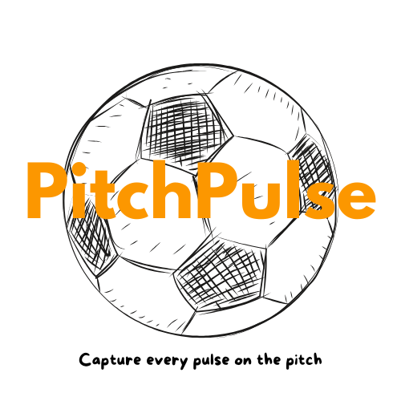

# Introducing, PitchPulse 📈 ⚽️!

#### [Deployed App](https://pitchpulse-stats-tracker-64624263c55c.herokuapp.com/)

## Description

This project is a browser-based soccer performance tracker called PitchPulse where users can “capture every pulse on the pitch.” After signing up, you can log each match by entering the game number, date, location, result, goal difference, goals and assists of your most recent game. Your personal dashboard displays every game in a list as well as calculates your total games, goals, assists, and win/loss/draw metrics alongside your averages (goals per game, assist rate, win percentage). Everything is stored in MongoDB, with intuitive forms for creating, editing and deleting entries, plus real-time updates so you always see your latest stats at a glance, perfect for spotting trends and measuring your progress over time. PitchPulse also allows you to view other members stats so you can see where you stand overall compared to your teammates and opponents!

#### Background Info

I chose to create a soccer specific stats tracking application due to my love of both analytics and playing the beautiful game. As a regular pick-up soccer player, I have always kept individual notes on my game metrics so that I could measure my performance over time. By creating PitchPulse, I now have a centralized place to easily record all of these metrics and review my overall performance. Best of all, my friends, teammates and rivals can all do the same, fostering honest, stats driven competition, bragging rights, and continuous improvement, all in one place!

## External Resources / Attributions

#### [Project Planning Materials](https://trello.com/invite/b/68bdb8b69b4c8cb5897ac4ed/ATTI9ef859074a6fd4507065298b414584f23A8A835E/joel-izzedin-p2-planning-soccer-stats-tracker)

I relied primarily on my own logic and coding skills learned in class thus far, as well as experimenting and problem-solving through trial and error. Reference checks were made to previous lecture and lab materials as well as standard documentation like MDN Web Docs. The only reference made to generative AI in this project was to create a Mongoose setter in my user model that converts the date field in the gameStats schema from UTC to local time.

## Technologies Used

Git, MongoDB, Node.js, Javascript, HTML, CSS, npm, Express, Mongoose, EJS, bcrypt, dotenv, method-override, morgan. 

## Next Steps & Planned Future Enhancements

**Smart Form Behavior**: Restrict certain form inputs depending on previous inputs.
- Automatically set Goal Difference to 0 when a match is marked as a Draw.
- Enforce Goal Difference to be a positive number for Wins and a negative number for Losses.
- Dynamically suggest the next Game Number based on existing entries.

**Teammate Integration**:
- Allow users to tag teammates when logging match stats.
- Limit teammate selection to registered users, creating shared history and accountability.

**Group-Based Profiles**:
- Enable the creation of private leagues or groups, each with its own player roster.
- Protect group membership with invitation codes or passwords, so communities can track stats collectively.

**Style for Mobile**:
- Apply mobile first styling principles as current styling is geared towards a desktop view.
